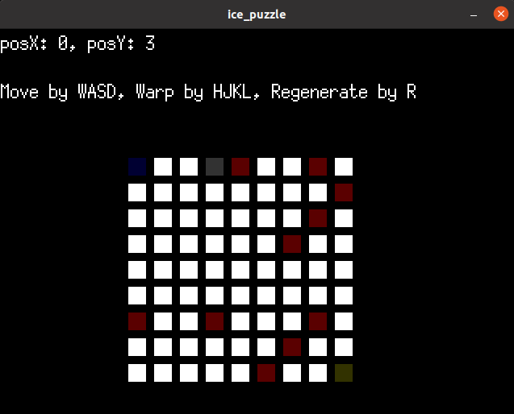

# ice_puzzle
simple 2D-grid game made with [Ebiten](https://ebiten.org/)


## run
```
go run main.go
```
### for windows
run main.exe.

## util
- util.py solve the puzzle from text file from below format
```
H W
sx sy
gx gy
s..
...
..g
```
- util.py also can generate files
## to improve
- [x] auto-generate puzzle by using solver
